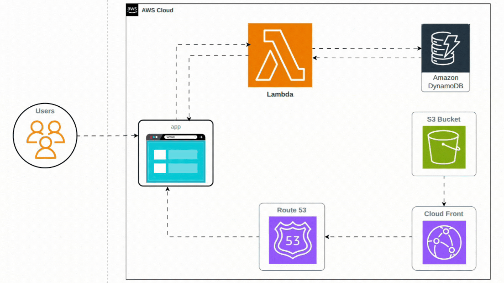

# VisitCounter - Serverless Website Visit Tracker

## 📊 Overview
**VisitCounter** is a serverless web application that tracks and displays the total number of visits to a website in real-time.  
It is built entirely on AWS serverless services — **S3**, **CloudFront**, **Route 53**, **Lambda**, and **DynamoDB**.  
This architecture is cost‑effective, scalable, and requires minimal operational overhead.

---

## 🏗️ Architecture



**Components:**
- **S3 Bucket** → Hosts static website files (HTML, CSS, JS).
- **CloudFront** → Global CDN with HTTPS, caching, and DDoS protection.
- **Route 53** → DNS management and domain routing.
- **Lambda Function** → Serverless backend to handle visit counting logic.
- **DynamoDB** → NoSQL database storing visit count with atomic increments.

---

## 📁 Application Code

### Frontend (S3 Bucket)
- `index.html` → Main webpage displaying the visit counter.
- `style.css` → Stylesheet for responsive design and layout.
- `script.js` → JavaScript calling the Lambda function API to fetch and update the visit count.

### Backend (Lambda)
- Node.js function using AWS SDK v3.
- Atomic counter updates in DynamoDB.
- Returns JSON response with proper CORS headers.

---

## ⚙️ S3 Bucket Configuration
- Static website hosting enabled.
- Correct MIME types (`text/html`, `text/css`, `application/javascript`) applied.
- CORS policy allowing cross‑origin requests.
- Bucket policy restricting access to CloudFront only.

---

## 🌐 CloudFront Distribution
- Origin set to S3 bucket.
- HTTPS enforced via ACM certificate.
- Custom domain support through Route 53.
- Cache invalidation configured for deployment updates.
- Error page setup for SPA routing.

---

## 🔗 Route 53 DNS Configuration
- Hosted zone created for custom domain.
- Alias records pointing to CloudFront distribution.
- SSL certificate validation via ACM.
- DNS propagation handled automatically.

---

## ⚡ Lambda Function
- Node.js runtime (`nodejs20.x`).
- IAM role with DynamoDB access.
- Atomic increment logic for visit counter.
- Handles `OPTIONS` preflight requests for CORS.
- Returns JSON with updated visit count.

---

## 💾 DynamoDB Database
- Table: `visitcounter-db-table`.
- Primary key: `id` (string).
- Attribute: `visit` (number).
- On‑demand capacity for cost efficiency.
- Atomic updates via `UpdateCommand`.

---

## 🚧 Challenges & Solutions

### 1. CloudFront Downloading Files Instead of Rendering
- **Cause**: Incorrect MIME types in S3 object metadata.  
- **Solution**: Updated Terraform to set proper `content_type` for each file extension.

### 2. CORS Origin Blocking
- **Cause**: Missing CORS headers in Lambda responses and incomplete CloudFront origin config.  
- **Solution**:  
  - Added `Access-Control-Allow-Origin` headers in Lambda.  
  - Allowed both HTTP and HTTPS origins.

### 3. CloudFront Cache Invalidation
- **Cause**: Cached versions served with long TTL.  
- **Solution**:  
  - Created invalidations (`/*`) during deployment.  
  - Configured cache behaviors and TTLs.  
  - Implemented cache busting for critical updates.

---

## 🚀 Setup & Deployment Guide

### Prerequisites
- AWS account with permissions for S3, CloudFront, Route 53, Lambda, DynamoDB.
- Terraform installed.
- AWS CLI configured.
- Domain name (optional, for custom domain setup).

---

### Step 1: Clone the Repository
```bash
git clone <repository-url>
cd visitcounter

```

### Step 2: Update the backend.tf
```
terraform {
  backend "s3" {
    bucket = "<Bucket name>"
    key    = "<Your state file name>"
    region = "<Region>"
    encrypt = true
    use_lockfile = true
  }
}
```
### Step 4: Update Your allowed origins
**File: lambda/index.js**

```
const allowedOrigins = [
    "https://<Your domain>.foo",
    "http:<localhost url>",
  ];
```
### Step 4: Run commands

```
tf init
tf plan
tf apply -auto-approve
```


### Step 5: Collect url and ns from the logs

```
cloudfront_dns = "<cloudfront dns>"
lambda_function_url = "https:/<lambda url>"

name_servers = tolist([
  "ns-1210.awsdns-23.org",
  "ns-1619.awsdns-10.co.uk",
  "ns-235.awsdns-29.com",
  "ns-729.awsdns-27.net",
])
```

### Step (optional): Update Your allowed origins if you don't have a domain
**File: lambda/index.js**
```
const allowedOrigins = [
    "https://<cloudfront dns>",
    other domain
  ];

tf apply -auto-approve
```

### Step 6: Put your nameserver to your domain

EXAMPLE :
```
name_servers = tolist([
  "ns-1210.awsdns-23.org",
  "ns-1619.awsdns-10.co.uk",
  "ns-235.awsdns-29.com",
  "ns-729.awsdns-27.net",
])
```
### Step 7: Validate the output of lambda function

```
curl <lambda function url>
```

### Final step:
```
HIT YOUR DNS(cloudfront dns | your app domain name) NAME IN THE BROWSER
```


